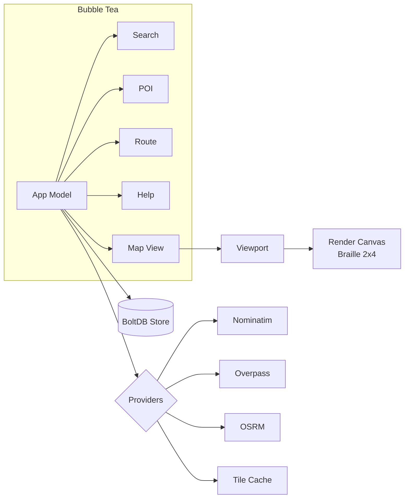

# CarTUI

```
   ____           _____ _   _ ___
  / ___|__ _ _ __|_   _| | | |_ _|
 | |   / _` | '__|  | | | | | || |
 | |__| (_| | |     | | | |_| || |
  \____\__,_|_|     |_|  \___/|___|
```

A terminal-native cartography app: pan, zoom, search, route and bookmark the
world from your shell. CarTUI renders OpenStreetMap data through a
sub-pixel **Braille canvas** (8 dots per terminal cell) and 24-bit ANSI
colour. No GUI, no GPU, no telemetry.

[](https://github.com/cycl0o0/cartui/actions/workflows/ci.yml)
[](LICENSE)
[](https://pkg.go.dev/github.com/cycl0o0/cartui)

> Status: **alpha**. Core rendering, search, POIs and routing work. Vector
> tiles are fetched live from Overpass; raster tiles are an opt-in fallback.

## Features

- **Vector map rendering** — Overpass features rasterised onto a Braille
  canvas with layered colour priorities (water → green → buildings →
  roads → POIs → route → markers).
- **Search** — Nominatim with debounced typing, history, and viewport
  centering on confirm.
- **Points of interest** — 11 categories with Unicode glyphs (🍽 ☕ 🏥 💊
  🏫 🚉 🏨 🛒 🏛 ⚽ 🏛). Side panel surfaces address, hours, phone, website.
- **Routing** — OSRM-backed driving / cycling / walking with turn-by-turn
  steps, total distance, ETA. Export to GPX 1.1.
- **Bookmarks & history** — persisted in BoltDB at the XDG cache path.
- **Themes** — `dark`, `light`, `mono` (the latter respects `NO_COLOR`).
- **Static binary** — pure Go, no cgo, runs everywhere Go runs.
- **Privacy** — no tracking, no telemetry. Every external call goes
  through a rate-limited, identifiable User-Agent.

## Installation

### From source

```bash
go install github.com/cycl0o0/cartui/cmd/cartui@latest
```

### Build locally

```bash
git clone https://github.com/cycl0o0/cartui.git
cd cartui
make build
./cartui
```

Binaries for Linux / macOS / Windows are published on every tagged release;
see the [Releases](https://github.com/cycl0o0/cartui/releases) page (TODO:
AUR + Nixpkg).

## Quickstart

```bash
# Default: opens the map on Bordeaux
cartui

# Jump to a place by name
cartui --goto "Place de la Bourse, Bordeaux"

# Lat/lng + zoom
cartui --lat 48.8566 --lng 2.3522 --zoom 12

# Force ASCII rendering and a light theme
cartui --ascii --theme light

# English UI
cartui --lang en
```

Once the TUI is running:

| Key       | Action                            |
| --------- | --------------------------------- |
| `h j k l` | Pan left / down / up / right      |
| `+` / `-` | Zoom in / out                     |
| `gg`      | Centre on the default location    |
| `0`       | Reset view                        |
| `/`       | Search                            |
| `p`       | POI menu                          |
| `i`       | Routing wizard                    |
| `f` / `F` | Add bookmark / list bookmarks     |
| `Tab`     | Toggle sidebar                    |
| `?`       | Help screen                       |
| `q`       | Quit                              |

Full mapping: [`docs/KEYBINDINGS.md`](docs/KEYBINDINGS.md).

## Configuration

CarTUI reads `${XDG_CONFIG_HOME:-$HOME/.config}/cartui/config.toml` on
startup. Every key is overridable via `CARTUI_*` environment variables.

```toml
[ui]
theme = "dark"           # dark | light | mono
sidebar = true
lang = "fr"              # fr | en

[map]
default_lat = 44.8378    # Bordeaux 🌊
default_lng = -0.5792
default_zoom = 13
braille = true           # false -> ASCII fallback

[providers]
nominatim_url   = "https://nominatim.openstreetmap.org/"
overpass_url    = "https://overpass.private.coffee/api/interpreter"
osrm_url        = "https://router.project-osrm.org/"
osrm_profile    = "driving"
tomtom_url      = "https://api.tomtom.com"
tomtom_api_key  = ""                       # paste your free TomTom dev key to enable traffic

[providers.rate]
nominatim_rps = 1.0
overpass_rps  = 0.5
osrm_rps      = 5.0

[cache]
tile_ttl_hours = 168
overpass_ttl_minutes = 60

[network]
timeout_seconds = 15
retries = 3
```

Cache and bookmarks live at
`${XDG_CACHE_HOME:-$HOME/.cache}/cartui/cartui.db`.

## Architecture



Detailed write-up: [`docs/ARCHITECTURE.md`](docs/ARCHITECTURE.md).

## Why AGPL?

CarTUI links the work of OpenStreetMap, Nominatim, Overpass and OSRM —
all licensed under copyleft terms. AGPL-3.0-or-later keeps the spirit of
their commons intact:

- If you fork CarTUI and run it as a service, your modifications must be
  shared back.
- Anyone receiving a binary or running the service can request the
  exact source code that produced it.

That trade — strong copyleft for community guarantees — fits an OSM-based
project better than a permissive licence.

## Credits

- [OpenStreetMap](https://www.openstreetmap.org) contributors — map data
  © OSM, available under [ODbL](https://www.openstreetmap.org/copyright).
- [Nominatim](https://nominatim.org) — geocoding.
- [Overpass API](https://overpass-api.de) — vector data extraction.
- [OSRM](https://project-osrm.org) — routing.
- [Charm](https://charm.sh) — Bubble Tea, Lipgloss, Bubbles.
- [bbolt](https://github.com/etcd-io/bbolt) — embedded key/value store.

CarTUI respects upstream usage policies: rate-limited requests,
identifiable User-Agent, aggressive local caching. Please do the same if
you self-host.

## Contributing

Pull requests welcome. Read [`CONTRIBUTING.md`](CONTRIBUTING.md) first —
short version: Conventional Commits, DCO sign-off, `make test lint` must
pass.

## License

[AGPL-3.0-or-later](LICENSE). © 2026 Cycl0o0.
